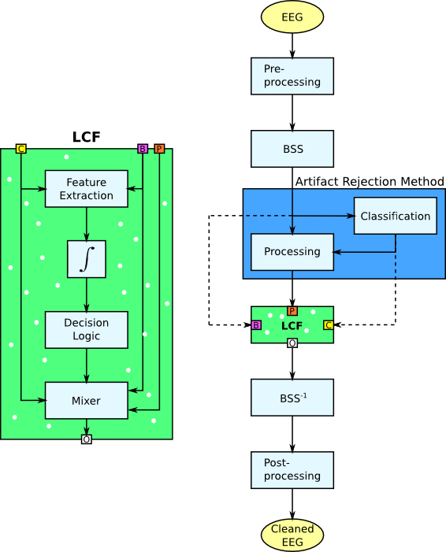

.. _lcf:

===================================
Localized Component Filtering (LCF)
===================================

LCF is a methodology developed for the rejection of artifacts from EEG signals,
and more precisely, for the boosting of existing artifact rejection methods
based on the decomposition of the EEG signals by Blind Source Separation (BSS)
algorithms.

When a component is identified to carry artifacts, the common practice it to
fully remove it or to process it with a cleaning algorithm. However, because
BSS algorithms are yet not capable of perfectly dissociate noise and neural
activity, part of the later is inevitably lost. This is specially true in
scenarios with reduced amount of channels or data.

LCF tries to minimize this leakage by reducing the scope of application of
whatever technique (rejection or cleaning). To do so, it identifies noisy
segments within each component and focus the cleaning process on these segments,
leaving the remaining of the component (which presumably does not carry any
noise) intact, hence reducing the leakage of useful information.

To facilitate the integration of LCF within any existing artifact rejection
system based on BSS, it was designed as a single component which receives as
inputs the original component and the corrected version, and returns a new
version based on their mixing. In order words, the output is composed of the
original component whenever noise is not detected, and of the corrected
component when noise is detected.

    On the right, the block diagram of a typical EEG artifact rejection system.
    On the left, a detailed diagram of the LCF component.

The *classification* block of the figure labels the components as clean or
artifactual, while the *processing* block applies the correction method. Note
that the LCF component represents a component embedded into the original
system, without any further modifications.